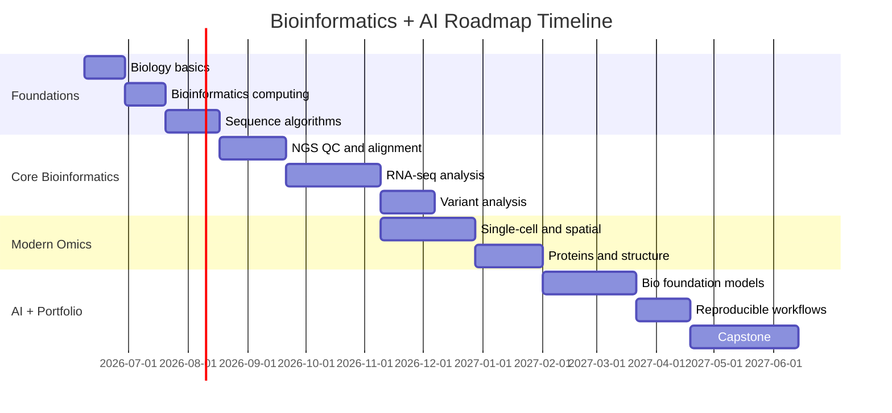

# Weekly Study Plan

**Updated:** 2026-06-08

This is a practical 36-week plan. You can compress it to 16–20 weeks if you study heavily, or stretch it to a year if you are doing projects alongside university/work.

## Milestone View

---

## Weeks 1–2 — Biology Crash Start

### Learn

- [ ] Cell basics.
- [ ] DNA/RNA/protein.
- [ ] Central dogma.
- [ ] Genes, exons, introns, transcripts.
- [ ] Mutations and variants.
- [ ] Gene expression.

### Watch / read

- [ ] Khan Academy: central dogma and gene expression.
- [ ] NCBI intro training pages.
- [ ] Arabic companion: intro bioinformatics / central dogma playlist.

### Build

- [ ] `notes/biology_terms.md` with 50 terms.
- [ ] One diagram: sample → sequencing → computational data.

### Done when

- [ ] You can explain why DNA sequence, RNA expression, and protein function are different data problems.

---

## Weeks 3–4 — Data Formats and Databases

### Learn

- [ ] FASTA.
- [ ] FASTQ.
- [ ] SAM/BAM.
- [ ] VCF.
- [ ] BED.
- [ ] GTF/GFF.
- [ ] GEO/SRA/NCBI/UniProt/AlphaFold DB.

### Build

- [ ] Python FASTA parser.
- [ ] Python FASTQ parser with quality summary.
- [ ] Download one FASTA sequence from NCBI/UniProt and record provenance.
- [ ] Create project skeleton template.

### Done when

- [ ] You can identify file type from extension and first few lines.
- [ ] You can explain why raw data must not be overwritten.

---

## Weeks 5–7 — Command Line, Environments, and Project Hygiene

### Learn

- [ ] WSL/Linux command line.
- [ ] Conda/Mamba/Micromamba.
- [ ] Git basics.
- [ ] Checksums.
- [ ] Sample sheets.
- [ ] File organization.

### Build

- [ ] `projects/template-bioinfo-project/`.
- [ ] `scripts/validate_samples.py`.
- [ ] `environment/environment.yml`.

### Done when

- [ ] You can reproduce an environment and rerun a script from scratch.

---

## Weeks 8–11 — Sequence Algorithms

### Learn

- [ ] k-mers.
- [ ] Reverse complement.
- [ ] Edit distance.
- [ ] Dynamic programming alignment.
- [ ] BLAST intuition.
- [ ] BWT/FM-index intuition.

### Practice

- [ ] Rosalind Python Village.
- [ ] Rosalind Bioinformatics Stronghold basics.
- [ ] Bioinformatics Algorithms free chapters/videos.

### Build

- [ ] `toy_seqtools`: command-line Python package.
- [ ] Toy local aligner.
- [ ] Toy k-mer search.

### Done when

- [ ] You can explain alignment scoring and why heuristics are needed.

---

## Weeks 12–16 — NGS Core Pipeline

### Learn

- [ ] Sequencing reads.
- [ ] FastQC/MultiQC.
- [ ] trimming.
- [ ] alignment.
- [ ] BAM sorting/indexing.
- [ ] reference genomes.

### Build

- [ ] QC report for example FASTQ files.
- [ ] Small alignment pipeline.
- [ ] MultiQC output folder.
- [ ] `reports/ngs_qc_report.md`.

### Done when

- [ ] You can go from FASTQ to QC report and aligned BAM on toy data.

---

## Weeks 17–23 — RNA-seq Main Project

### Learn

- [ ] Quantification.
- [ ] Count matrices.
- [ ] DESeq2.
- [ ] edgeR.
- [ ] design formula.
- [ ] multiple testing.
- [ ] enrichment.

### Build

- [ ] Download public GEO/SRA RNA-seq dataset.
- [ ] Create sample metadata file.
- [ ] Run quantification or use provided counts.
- [ ] Perform DESeq2 differential expression.
- [ ] Create PCA, MA plot, volcano plot, heatmap.
- [ ] Write full reproducibility report.

### Done when

- [ ] You can defend the design formula and explain adjusted p-values.

---

## Weeks 24–27 — Variant Analysis

### Learn

- [ ] VCF fields.
- [ ] variant calling.
- [ ] filtering.
- [ ] annotation.
- [ ] reference builds.

### Build

- [ ] Toy variant calling workflow.
- [ ] VCF parser/summary notebook.
- [ ] Variant annotation report.

### Done when

- [ ] You can explain why GRCh37 vs GRCh38 mismatch is a serious problem.

---

## Weeks 28–34 — Single-cell + Spatial

### Learn

- [ ] AnnData/H5AD.
- [ ] Scanpy workflow.
- [ ] Seurat concepts.
- [ ] QC metrics.
- [ ] normalization.
- [ ] HVGs.
- [ ] clustering.
- [ ] cell type annotation.
- [ ] integration.
- [ ] spatial transcriptomics overview.

### Build

- [ ] Scanpy tutorial-style analysis.
- [ ] Cell type classifier baseline.
- [ ] Batch-effect visualization.
- [ ] Optional: Squidpy spatial tutorial.

### Done when

- [ ] You can explain why UMAP clusters are not automatically “cell types.”

---

## Weeks 35–40 — Proteins + Structural Bioinformatics

### Learn

- [ ] protein sequences.
- [ ] UniProt.
- [ ] PDB/mmCIF.
- [ ] AlphaFold DB.
- [ ] pLDDT and PAE.
- [ ] protein language models.

### Build

- [ ] Protein sequence retrieval script.
- [ ] Protein embedding classifier.
- [ ] AlphaFold structure viewer/report.
- [ ] Similarity search notebook.

### Done when

- [ ] You can explain difference between sequence similarity, functional similarity, and structural similarity.

---

## Weeks 41–48 — AI-for-Bioinformatics Foundation Models

### Learn

- [ ] DNA language models.
- [ ] protein language models.
- [ ] cell foundation models.
- [ ] graph ML for biological networks.
- [ ] multimodal omics.
- [ ] leakage-safe evaluation.

### Build

Choose one:

- [ ] DNA FM benchmark on small regulatory classification dataset.
- [ ] protein LM embeddings for enzyme/function prediction.
- [ ] scGPT/scVI/Scanpy embedding comparison.
- [ ] pathway-aware graph ML classifier.

### Done when

- [ ] You have a clean ML experiment with baselines, split logic, and a reproducibility report.

---

## Weeks 49–56 — Reproducible Workflows and Agents

### Learn

- [ ] Snakemake.
- [ ] Nextflow basics.
- [ ] nf-core pipelines.
- [ ] Docker/Apptainer concepts.
- [ ] workflow linting.
- [ ] metadata validation.

### Build

- [ ] Convert an RNA-seq workflow into Snakemake.
- [ ] Run an nf-core toy/test pipeline.
- [ ] Build `biofile-inspector`: detects FASTA/FASTQ/BAM/VCF/count matrix/H5AD.
- [ ] Build `bio-workflow-validator`: catches common sample sheet and path errors.

### Done when

- [ ] You can rerun a pipeline from scratch and explain every output.

---

## Weeks 57+ — Capstone / Research Portfolio

Pick one serious capstone:

- [ ] **Agentic Bioinformatics Workflow Repair Benchmark**.
- [ ] **Leakage Audit of Omics ML Datasets**.
- [ ] **Protein/DNA Foundation Model Comparison under Low Compute**.
- [ ] **Single-cell Foundation Model vs Classical Pipeline Evaluation**.
- [ ] **Bioinformatics Dataset Provenance + Metadata QA Tool**.

### Final deliverables

- [ ] GitHub repository.
- [ ] README with reproducible commands.
- [ ] Environment file/container.
- [ ] Results report.
- [ ] Limitations section.
- [ ] Optional paper-style PDF/Markdown.

