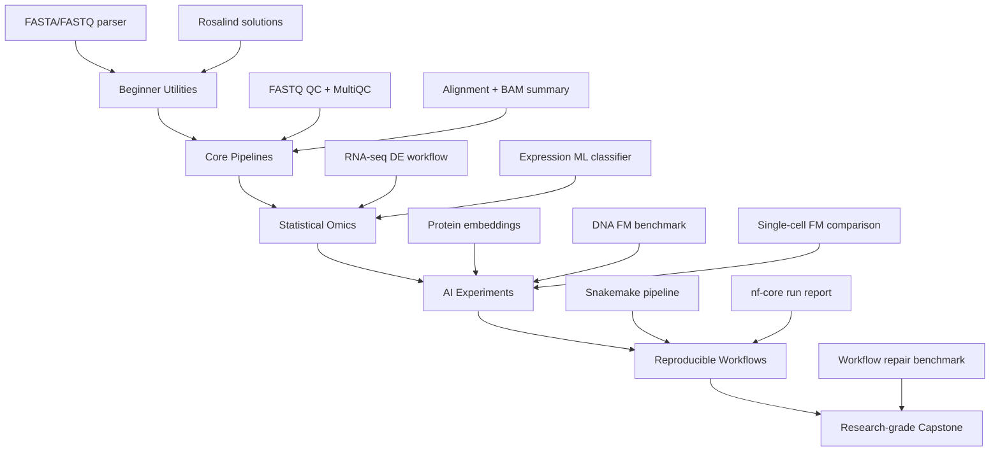
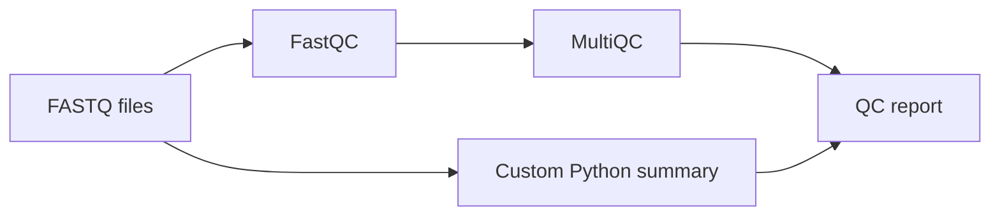

# Bioinformatics + AI Project Portfolio

**Updated:** 2026-06-08

The projects below are ordered from beginner to research-grade. Each project includes a deliverable, what it teaches, and a quality bar.

## Portfolio Architecture

---

## Level 0 — Setup Projects

### Project 0.1 — Bioinformatics Workspace Template

**Goal:** create a reusable structure for every future project.

Checklist:

- [ ] Create `projects/template-bioinfo-project/`.
- [ ] Add `README.md`.
- [ ] Add `data/raw`, `data/external`, `data/interim`, `data/processed`.
- [ ] Add `metadata/samples.tsv` and `metadata/data_dictionary.md`.
- [ ] Add `src`, `scripts`, `notebooks`, `workflows`, `configs`, `reports`, `tests`, `environment`.
- [ ] Add `.gitignore` that excludes large data and environment artifacts.
- [ ] Add `environment/environment.yml`.

Quality bar:

- [ ] Another person can understand what goes where.
- [ ] Raw data is clearly protected.

---

## Level 1 — Beginner Computational Biology

### Project 1.1 — FASTA/FASTQ Parser and QC Summary

**Teaches:** file formats, biological sequences, quality scores, Python scripting.

Deliverables:

- [ ] `src/bioio/fasta.py`.
- [ ] `src/bioio/fastq.py`.
- [ ] CLI: `python scripts/summarize_fastq.py --input reads.fastq.gz --out reports/qc.json`.
- [ ] Markdown report explaining read length distribution and quality scores.

Stretch:

- [ ] gzip support.
- [ ] streaming parser.
- [ ] unit tests.

Quality bar:

- [ ] Works on large files without loading everything into memory.

---

### Project 1.2 — Rosalind Solutions Repository

**Teaches:** sequence manipulation and algorithms.

Checklist:

- [ ] Solve first 20 Rosalind problems.
- [ ] Use clean functions, not notebook-only code.
- [ ] Add tests for each solution.
- [ ] Write short notes explaining biology behind each problem.

Quality bar:

- [ ] Problems are solved from understanding, not copied.

---

## Level 2 — Practical NGS

### Project 2.1 — FASTQ QC Dashboard

**Teaches:** sequencing quality, reports, reproducibility.

Pipeline:

Checklist:

- [ ] Download small public FASTQ test data.
- [ ] Run FastQC.
- [ ] Run MultiQC.
- [ ] Add custom Python summary.
- [ ] Write report explaining quality, adapter content, sequence duplication, GC distribution.
- [ ] Record commands and tool versions.

Quality bar:

- [ ] Report distinguishes “warning” from real failure.

---

### Project 2.2 — Toy Alignment and BAM Summary

**Teaches:** alignment files and reference matching.

Checklist:

- [ ] Use a small reference genome or simulated reads.
- [ ] Align reads using minimap2 or BWA.
- [ ] Convert SAM to BAM.
- [ ] Sort and index BAM.
- [ ] Summarize mapping rate.
- [ ] Visualize alignment in IGV or samtools tview.

Quality bar:

- [ ] Commands are reproducible and documented.

---

## Level 3 — RNA-seq Main Portfolio Project

### Project 3.1 — RNA-seq Differential Expression Workflow

**Recommended first serious project.**

Pipeline:

Checklist:

- [ ] Choose a small public dataset with clean two-condition design.
- [ ] Record accession IDs.
- [ ] Create `metadata/samples.tsv`.
- [ ] Validate sample names and condition labels.
- [ ] Use raw counts when running DESeq2/edgeR.
- [ ] Perform PCA/EDA.
- [ ] Run differential expression.
- [ ] Correct for multiple testing.
- [ ] Create volcano, MA, PCA, heatmap.
- [ ] Run gene set enrichment.
- [ ] Write limitations.

Quality bar:

- [ ] No biological overclaiming.
- [ ] Design formula is explicitly stated.
- [ ] Batch variables are inspected or limitations are documented.

---

### Project 3.2 — Expression-Based ML Classifier with Leakage Controls

**Teaches:** applying AI safely to omics data.

Checklist:

- [ ] Start from expression matrix and metadata.
- [ ] Create train/validation/test split by biological unit.
- [ ] Fit preprocessing on training only.
- [ ] Compare logistic regression, random forest, XGBoost/LightGBM, MLP.
- [ ] Use nested CV or a held-out test set.
- [ ] Report AUROC, AUPRC, confusion matrix, calibration.
- [ ] Use SHAP or coefficients carefully.
- [ ] Interpret top genes with pathway enrichment, not just isolated gene names.

Quality bar:

- [ ] Leakage audit section exists.

---

## Level 4 — Variant Analysis

### Project 4.1 — Toy Variant Calling Pipeline

Checklist:

- [ ] Use toy/small public data.
- [ ] Align reads.
- [ ] Sort/index BAM.
- [ ] Call variants.
- [ ] Filter variants.
- [ ] Annotate VCF fields.
- [ ] Write a report explaining each field.

Quality bar:

- [ ] Reference genome build is recorded.

---

### Project 4.2 — Variant Effect ML Baseline

Checklist:

- [ ] Pick a small labeled variant dataset.
- [ ] Build features: sequence context, conservation, annotation, allele frequency if allowed.
- [ ] Split carefully by gene/chromosome/patient/study depending on dataset.
- [ ] Compare simple baseline vs embedding model.
- [ ] Report limitations and label noise.

Quality bar:

- [ ] No clinical claim.

---

## Level 5 — Single-cell and Spatial

### Project 5.1 — Scanpy Single-cell Analysis

Checklist:

- [ ] Load public H5AD or 10x dataset.
- [ ] Run QC.
- [ ] Normalize/log-transform.
- [ ] Select highly variable genes.
- [ ] PCA/neighbors/UMAP.
- [ ] Cluster.
- [ ] Find marker genes.
- [ ] Annotate cell types cautiously.
- [ ] Write report explaining uncertainty.

Quality bar:

- [ ] UMAP is not overinterpreted.

---

### Project 5.2 — Classical vs Foundation Model Cell Embeddings

Checklist:

- [ ] Use a standard scRNA-seq dataset.
- [ ] Compare PCA/scVI/Scanpy representations to a single-cell foundation-model representation.
- [ ] Evaluate cell type classification or batch mixing.
- [ ] Include a classical baseline.
- [ ] Report compute constraints.

Quality bar:

- [ ] Claims are comparative and task-specific.

---

## Level 6 — Protein AI

### Project 6.1 — Protein Function Classifier with Embeddings

Checklist:

- [ ] Download protein sequences and labels from UniProt or a benchmark.
- [ ] Generate embeddings using an ESM-style model or smaller protein LM.
- [ ] Train simple classifiers.
- [ ] Split by sequence similarity if possible.
- [ ] Compare against k-mer/amino acid composition baseline.
- [ ] Write biological interpretation.

Quality bar:

- [ ] Similar sequences do not leak from train to test when evaluating generalization.

---

### Project 6.2 — AlphaFold DB Structure Interpretation Report

Checklist:

- [ ] Choose a protein family.
- [ ] Retrieve sequences from UniProt.
- [ ] Retrieve AlphaFold DB predictions.
- [ ] Interpret pLDDT and PAE.
- [ ] Compare confident domains vs low-confidence regions.
- [ ] Create structure screenshots.
- [ ] Document limitations.

Quality bar:

- [ ] You do not claim a predicted structure proves a mechanism.

---

## Level 7 — Agentic Bioinformatics

### Project 7.1 — BioFile Inspector

**Goal:** given a folder, identify file types, sizes, compression, sample naming issues, and possible pipeline routes.

Checklist:

- [ ] Detect FASTA, FASTQ, BAM, VCF, BED, GTF/GFF, count matrices, H5AD.
- [ ] Validate paired-end FASTQ names.
- [ ] Detect missing metadata.
- [ ] Generate `inspection_report.md`.
- [ ] Recommend next actions without running destructive commands.

Quality bar:

- [ ] Never modifies data.

---

### Project 7.2 — Bioinformatics Workflow Repair Benchmark

**Research-grade idea.**

Goal: create a benchmark where LLM/agent systems must diagnose and repair broken bioinformatics workflows.

Bug categories:

- [ ] Wrong input path.
- [ ] Bad sample sheet.
- [ ] FASTQ pair mismatch.
- [ ] Missing reference index.
- [ ] Wrong genome build.
- [ ] Malformed VCF.
- [ ] Wrong DESeq2 design formula.
- [ ] Package version conflict.
- [ ] Broken Snakemake rule.
- [ ] Broken Nextflow channel/process.
- [ ] Hidden data leakage in ML script.

Evaluation:

- [ ] repair success.
- [ ] command correctness.
- [ ] provenance completeness.
- [ ] no destructive operations.
- [ ] reproducibility.
- [ ] biological validity.

Quality bar:

- [ ] Benchmark has unit tests and expected fixes.

---

## Capstone Rubric

A project is portfolio-ready only if it has:

- [ ] Clear README.
- [ ] Data provenance.
- [ ] Environment file/container.
- [ ] Reproducible commands.
- [ ] Output report.
- [ ] Limitations.
- [ ] Tests or validation.
- [ ] No hidden raw data mutation.
- [ ] No biological overclaiming.

