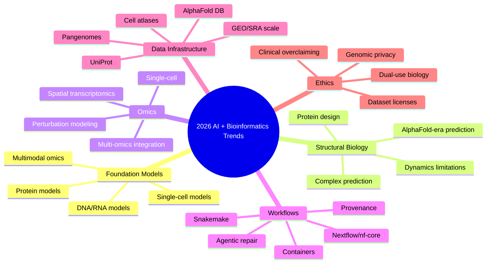

# Trends to Learn up to 2026: AI + Bioinformatics

**Updated:** 2026-06-08

This file captures what is current enough that an AI person entering bioinformatics should not ignore it.

## Trend Map

---

## 1. Bioinformatics Foundation Models

Foundation models are now a central direction in AI-for-biology. They appear across:

- [ ] genomics.
- [ ] transcriptomics.
- [ ] proteomics.
- [ ] drug discovery.
- [ ] single-cell analysis.
- [ ] spatial omics.

What to learn:

- [ ] pretraining objective.
- [ ] tokenization.
- [ ] biological unit of modeling: nucleotide, k-mer, gene, cell, residue, atom.
- [ ] fine-tuning vs probing.
- [ ] frozen embeddings vs end-to-end training.
- [ ] leakage-safe evaluation.
- [ ] biological validation.

Representative papers:

- Foundation models in bioinformatics: https://academic.oup.com/nsr/article/12/4/nwaf028/7979309
- DNA FM benchmark: https://www.nature.com/articles/s41467-025-65823-8
- genome language model survey: https://academic.oup.com/bib/article/27/1/bbaf724/8426124

---

## 2. DNA/RNA Language Models

Modern genome language models treat DNA/RNA as long biological sequence data, but not exactly like human language.

Important models/topics:

- [ ] DNABERT-style models.
- [ ] Nucleotide Transformer.
- [ ] Evo / Evo 2 style long-context genome models.
- [ ] Hyena/long convolution/long context architectures.
- [ ] variant effect prediction.
- [ ] regulatory element prediction.
- [ ] genome design and synthetic biology constraints.

Read:

- Nucleotide Transformer: https://www.nature.com/articles/s41592-024-02523-z
- Evo: https://www.science.org/doi/10.1126/science.ado9336
- Evo 2 official page: https://arcinstitute.org/tools/evo

Project:

- [ ] Benchmark DNA embeddings against k-mer and one-hot baselines on a small regulatory classification task.

---

## 3. Protein Language Models and Protein Design

Proteins are one of the most mature AI-bio areas.

Important concepts:

- [ ] sequence → structure → function.
- [ ] protein embeddings.
- [ ] sequence similarity leakage.
- [ ] structure-aware models.
- [ ] generative protein design.
- [ ] wet-lab validation gap.

Read:

- ESM3: https://www.science.org/doi/10.1126/science.ads0018
- AlphaFold 2: https://www.nature.com/articles/s41586-021-03819-2
- AlphaFold 3: https://www.nature.com/articles/s41586-024-07487-w

Project:

- [ ] Protein function classifier using embeddings + sequence-identity-aware split.

---

## 4. AlphaFold-Era Structural Bioinformatics

AlphaFold changed access to structure predictions, but predicted structures are not experimental truth.

Learn:

- [ ] pLDDT.
- [ ] PAE.
- [ ] domains vs flexible regions.
- [ ] protein complexes.
- [ ] ligands/nucleic acids/small molecules in AlphaFold 3-style modeling.
- [ ] limitations: conformational dynamics, disorder, environment, validation.

Resources:

- AlphaFold DB: https://alphafold.ebi.ac.uk/
- AlphaFold DB 2024 paper: https://pubmed.ncbi.nlm.nih.gov/37933859/
- AlphaFold DB 2025/2026 update: https://academic.oup.com/nar/article/54/D1/D358/8340156

Project:

- [ ] Compare AlphaFold DB predictions for a protein family and explain confidence/uncertainty.

---

## 5. Single-cell and Spatial Foundation Models

Single-cell data is exploding, and FMs are being used for cell embeddings, batch integration, perturbation, annotation, and spatial context modeling.

Learn:

- [ ] scRNA-seq classical workflow first.
- [ ] AnnData/H5AD.
- [ ] Scanpy/Seurat.
- [ ] scVI/scANVI.
- [ ] scGPT and related models.
- [ ] spatial transcriptomics.
- [ ] evaluation: batch mixing vs biological signal preservation.

Read:

- scGPT: https://www.nature.com/articles/s41592-024-02201-0
- Single-cell foundation models review: https://www.nature.com/articles/s12276-025-01547-5
- Nicheformer: https://www.nature.com/articles/s41592-025-02814-z

Project:

- [ ] Compare Scanpy PCA/scVI/scGPT representations for cell type classification or integration.

---

## 6. Multimodal Omics and Virtual Cell Direction

The field is moving from isolated data types toward models that combine:

- [ ] gene expression.
- [ ] variants.
- [ ] epigenomics.
- [ ] spatial context.
- [ ] perturbation data.
- [ ] proteins/pathways.
- [ ] clinical metadata.

What to learn:

- [ ] early fusion, late fusion, cross-attention.
- [ ] missing modality handling.
- [ ] batch/study confounding.
- [ ] patient-level split.
- [ ] causal and perturbation evaluation.

Project:

- [ ] Multi-omics toy fusion model with strict leakage control.

---

## 7. Workflow Automation and Agentic Bioinformatics

This is especially relevant to your agent-system interests.

Why it matters:

- Bioinformatics workflows are fragile.
- Tools have complex command-line syntax.
- Errors are often silent or biological, not just programming errors.
- Reproducibility depends on exact commands, versions, reference data, and metadata.

Current directions:

- [ ] documentation-grounded command generation.
- [ ] workflow generation from notebooks/ad-hoc scripts.
- [ ] sample-sheet validation.
- [ ] tool-version-aware command synthesis.
- [ ] pipeline linting and repair.
- [ ] provenance-aware agents.

Read:

- oxo-call: https://arxiv.org/abs/2604.12387
- Snakemaker: https://arxiv.org/abs/2505.02841
- nf-core/Nextflow community paper: https://link.springer.com/article/10.1186/s13059-025-03673-9

Project:

- [ ] Build an LLM-agent benchmark for repairing broken Snakemake/Nextflow/RNA-seq/VCF workflows.

---

## 8. Pangenomics and Long Reads

Reference-genome thinking is moving beyond single linear references.

Learn:

- [ ] pangenome graphs.
- [ ] structural variants.
- [ ] long-read sequencing: Oxford Nanopore / PacBio.
- [ ] methylation detection.
- [ ] graph-based references.

Project:

- [ ] Literature review + toy pangenome graph tutorial.

---

## 9. Responsible AI, Privacy, and Biosafety

Bioinformatics can involve sensitive human genomic/health data and dual-use biological information.

Checklist:

- [ ] Understand human genomic privacy risk.
- [ ] Never de-anonymize individuals.
- [ ] Avoid clinical claims from research pipelines.
- [ ] Track dataset license and consent restrictions.
- [ ] Be careful with generative biology and pathogen/toxin design topics.
- [ ] Prefer defensive, educational, and reproducible uses.

---

## Trend Learning Checklist

- [ ] I can explain where foundation models fit and where they are overhyped.
- [ ] I know at least one DNA model, one protein model, and one single-cell model.
- [ ] I can explain why classical baselines are mandatory.
- [ ] I can evaluate a bio-AI paper for leakage and biological validity.
- [ ] I can build a small but rigorous benchmark.

