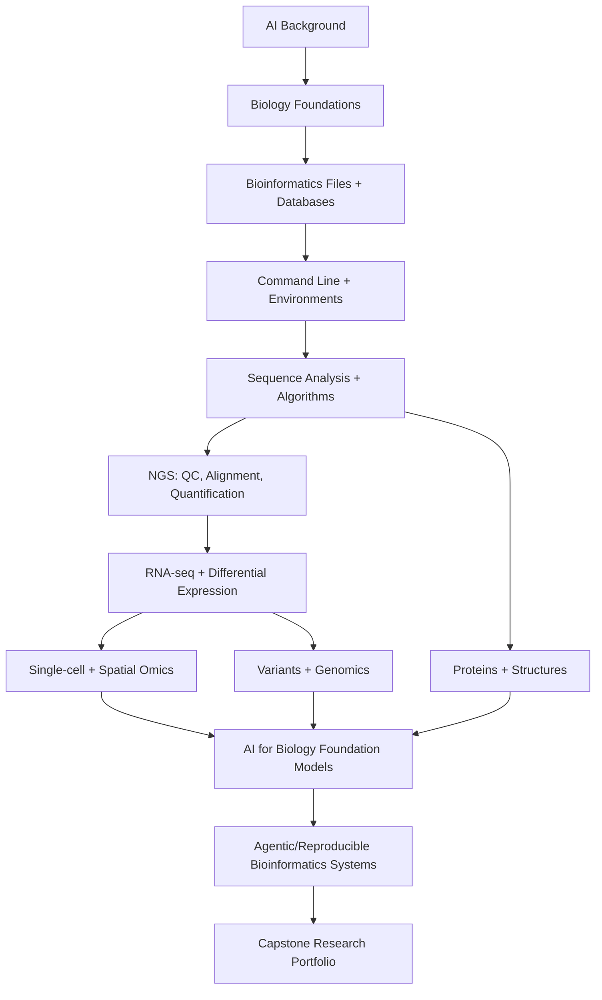

# Bioinformatics + AI Roadmap Pack

**Updated:** 2026-06-08  
**Designed for:** an AI/ML/DL/LLM practitioner starting bioinformatics from almost zero biology.  
**Goal:** become capable of reading bioinformatics papers, running real pipelines, building reproducible projects, and doing modern AI-for-biology work without making biologically invalid claims.

## How to Use This Pack

Start with the files in this order:

- [ ] `00_MASTER_ROADMAP.md` — the full roadmap and phase logic.
- [ ] `01_WEEKLY_STUDY_PLAN.md` — a week-by-week plan with checkboxes.
- [ ] `02_RESOURCE_CATALOG_EN_AR.md` — English and Arabic resources, mostly free.
- [ ] `03_PROJECT_PORTFOLIO.md` — projects from beginner to research-grade.
- [ ] `04_KEY_PAPERS_READING_MAP.md` — key classic and modern papers.
- [ ] `05_BOOKS_AND_REFERENCES.md` — free/open books first, paid references second.
- [ ] `06_TRENDS_2026_AI_BIOINFORMATICS.md` — what is current up to 2026.
- [ ] `07_BIOINFORMATICS_TOOLKIT_CHECKLIST.md` — commands, tools, databases, file formats.
- [ ] `08_CLAUDE_CODE_WORKFLOW.md` — how to use this inside `E:\Bioinformatics` with Claude Code memory.

## Roadmap Philosophy

You already know AI. That is an advantage, but it can also be dangerous in bioinformatics: biological datasets are small, biased, confounded, batch-effect-heavy, and easy to leak. This roadmap therefore prioritizes:

1. **Biology enough to avoid nonsense.**
2. **Real data formats and pipelines.**
3. **Statistical thinking and experimental design.**
4. **Reproducibility and provenance.**
5. **AI only after the data layer is understood.**
6. **Modern foundation models and agentic workflows once the fundamentals are stable.**

## Suggested Main Track

## Completion Definition

You are no longer a beginner when you can do all of this:

- [ ] Explain DNA → RNA → protein and how it relates to sequencing data.
- [ ] Read/write FASTA, FASTQ, SAM/BAM, VCF, BED, GTF/GFF, count matrices, and H5AD at a basic level.
- [ ] Download public data from NCBI/GEO/SRA/UniProt/AlphaFold DB with recorded provenance.
- [ ] Run QC on sequencing data and interpret quality reports.
- [ ] Build a reproducible RNA-seq pipeline or use a standard pipeline correctly.
- [ ] Perform differential expression without confusing fold change, p-value, adjusted p-value, batch effects, and design formula.
- [ ] Analyze a small single-cell dataset with Scanpy or Seurat.
- [ ] Use protein/DNA/cell foundation-model embeddings for a controlled ML experiment.
- [ ] Avoid leakage in biological ML benchmarks.
- [ ] Build at least one workflow using Snakemake or Nextflow/nf-core.
- [ ] Write a professional reproducibility report.

## Minimal Setup Target

- Windows + PowerShell for file/project management.
- WSL2 or Linux environment for most bioinformatics tools.
- Conda/Mamba/Micromamba for environments.
- Python for AI, scripting, and Scanpy.
- R/Bioconductor for RNA-seq and many omics workflows.
- Snakemake first if you like Python; Nextflow/nf-core later for production/community pipelines.

